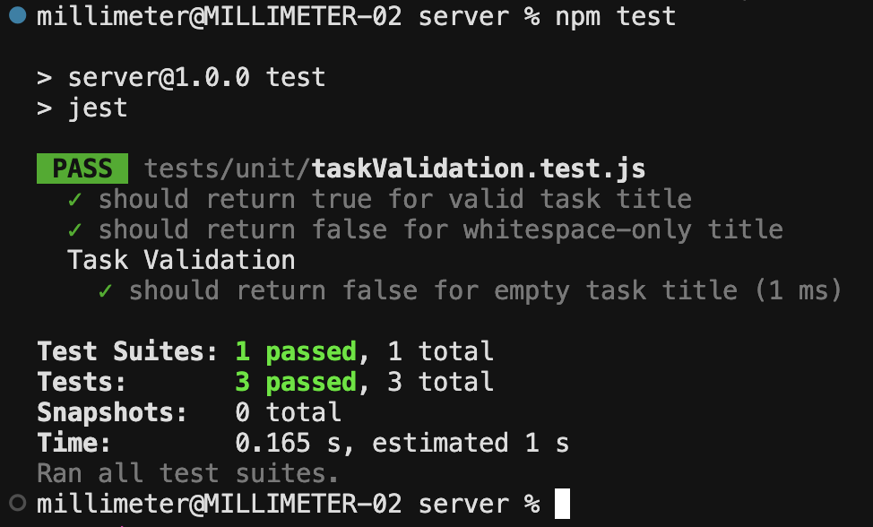
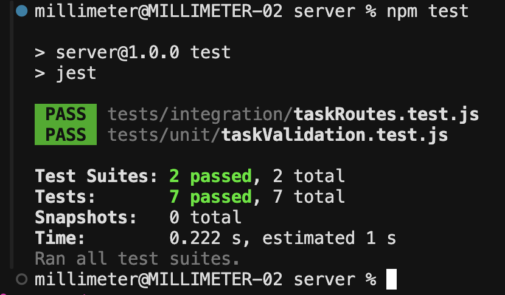
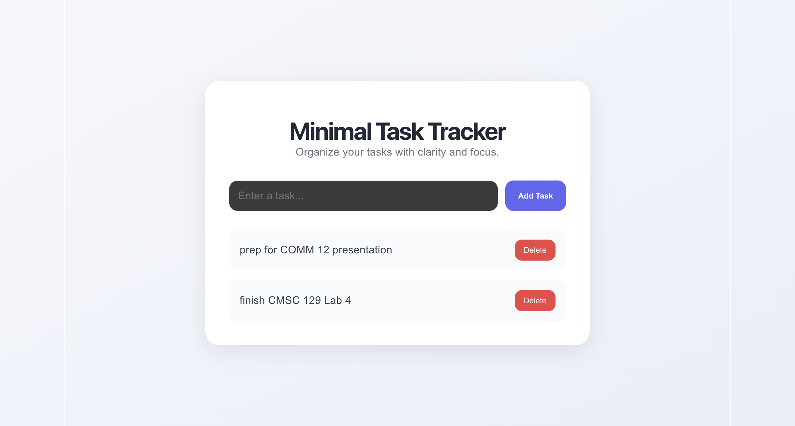
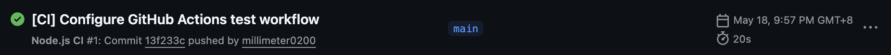

# Minimal Task Tracker

## 1. App Description

Minimal Task Tracker is a simple full-stack web application that allows users to manage their daily tasks efficiently. Users can add tasks, view all existing tasks, and delete completed tasks through a clean and minimal interface. The project was developed using React for the frontend and Express for the backend while following the Test-Driven Development (TDD) approach.

---

## 2. User Stories

1. As a student, I want to add tasks, so that I can keep track of requirements and deadlines.

2. As a user, I want to view all my tasks, so that I can organize my responsibilities clearly.

3. As a user, I want to delete completed tasks, so that I can keep my task list updated and uncluttered.

---

## 3. Tech Stack

### Frontend
- React
- Vite
- CSS

### Backend
- Node.js
- Express

### Testing Tools
- Jest
- Supertest

### Data Storage Approach
- In-memory JavaScript array storage

---

## 4. Testing Strategy

### Unit Testing
Unit tests were used to validate task input and business logic. These tests ensure that invalid task titles are rejected and valid tasks are accepted correctly.

### Integration Testing
Integration tests were implemented for API routes to verify that endpoints such as task creation, retrieval, and deletion work correctly with the backend application.

### System Testing
System testing was performed manually by running both frontend and backend servers simultaneously and verifying that users can add, display, and delete tasks through the user interface.

---

## 5. Setup Instructions

### Clone the Repository

```bash
git clone https://github.com/millimeter0200/CMSC129-Lab4-YapMM-OngCH.git
cd CMSC129-Lab4-YapMM-OngCH
```

---

### Backend Setup

```bash
cd server
npm install
npm run dev
```

Backend runs on:

```bash
http://localhost:5000
```

---

### Frontend Setup

Open another terminal:

```bash
cd client
npm install
npm run dev
```

Frontend runs on:

```bash
http://localhost:5173
```

---

### Running Tests

Inside the server folder:

```bash
npm test
```

---

## 6. Test Results

### Unit Test Results



---

### Integration Test Results



---

### System Test Results



---

### GitHub Actions CI Result

